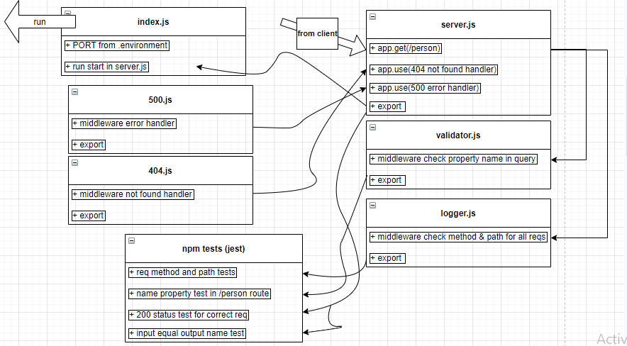

# Cloud Server

## deployed on AWS (Elastic Beanstalk)

# basic-express-server

**Author: Ahmad Abu Osbeh**
<br>

## deployin process

- done with AWS EB service.
- create new application called 'cloud-server'
- by GUI manually deployment, i compressed the coding files and uploaded on new environment in my application.
- then done successfully.

- for other wasy of deploying like; CLI, codepipeLine, and gitHub actions there is no access to them in educational account.

  **Setup**
  <br>

- .env requirements
- PORT - 3003
- Running the app
- npm start
- Endpoint: /person?name=${name}
- Returns : json with requested name

```
{
"domain": "http://cloudserver-env.eba-mewnpmxg.us-east-1.elasticbeanstalk.com/",
"status": "running",
"port": 3003
}
```

<example hit : http://cloudserver-env.eba-mewnpmxg.us-east-1.elasticbeanstalk.com/person?name=khaled>

# PR link

**https://github.com/Ahmad-AbuOsbeh/basic-express-server/pull/1**

**Tests**

**using supertest and jest**

- Unit Tests: npm run test

# UML

<br>


